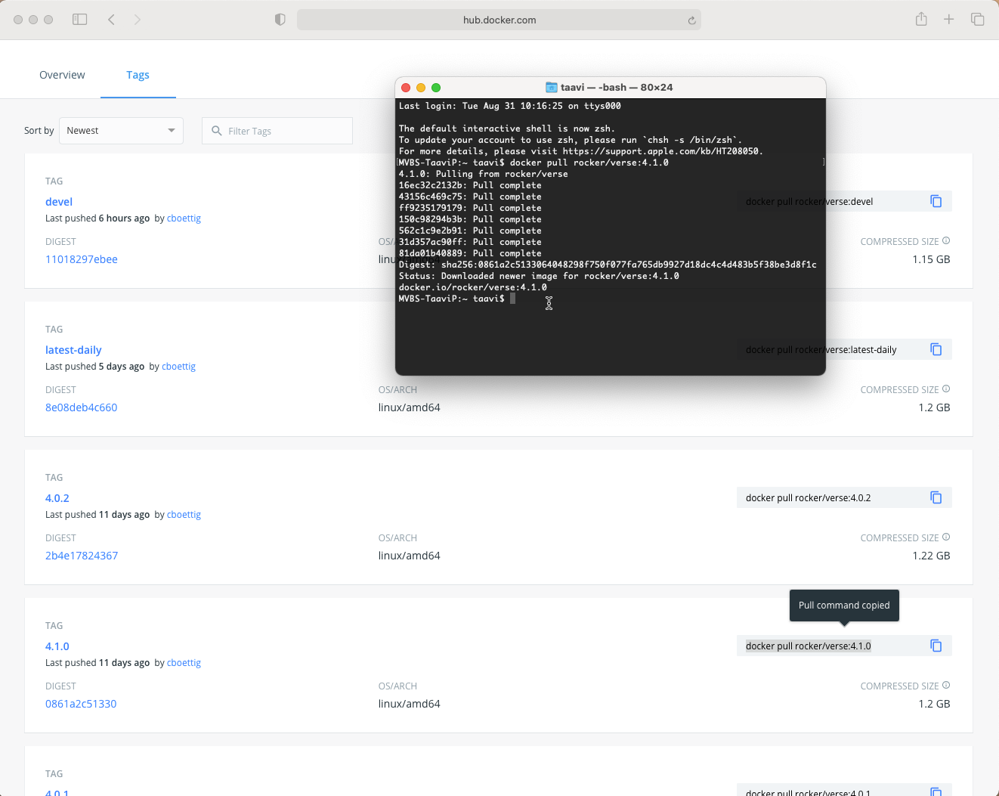
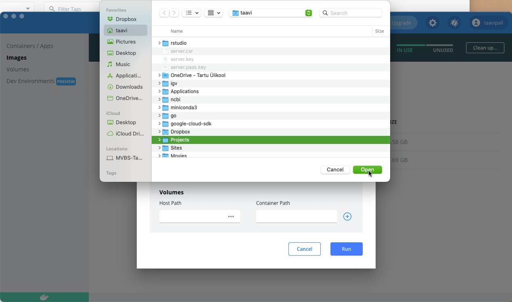

# Instructions how to setup Docker to run RStudio server

### Setting up Docker Desktop and Docker Hub account

1. Go to <https://www.docker.com/get-started> and download and install **Docker Desktop** for your OS (Windows users, Windows 10 is required) and then signup **Docker Hub** account (remember password). Installation and setup instructions can be also found from here (e.g. for Windows) <https://docs.docker.com/desktop/windows/install/>;

<center>

</center>

2. Start **Docker Desktop** and Sign in to your **Docker Hub** account;

<center>

</center>

### Pulling and running RStudio server

3. Go to <https://hub.docker.com> and choose **verse** image from the table. Verse image contains all necessary tidyverse packages and additionally packages that are required to create and publish reports;

<center>

</center>

4. Now find **Tags** tab (next to Overview) and copy __*docker pull rocker/verse:4.1.0*__ command to pull docker RStudio server image with R version 4.1.0;

<center>

</center>

5. Open a terminal (macOS) or command prompt window (such as the built-in command prompt, PowerShell, or Windows Terminal), and then run the following command (paste command from previous step) to download and install RStudio server:

```bash
docker pull rocker/verse:4.1.0
```

You could see something similar (alas, screenshot is from macOS terminal):

<center>

</center>

and after hitting enter

<center>

</center>

and after finishing

<center>

</center>


6. Now return to Docker Desktop, choose **Images** and you should see rocker/verse image with 4.1.0 tag listed, **click RUN**

<center>

</center>

7. We need to adjust some settings for our RStudio server. Go to **Optional Settings**:

<center>

</center>

8. We can see that it is possible to change container name, localhost port and it is possible to mount host volume to container, so that we can use files from our hard drive inside container. First we need to adjust port where server will be visible in localhost, we set port to **8787**:

<center>

</center>

9. Then we need to choose folder from hard drive that we want to mount to container to access/store files:

<center>

</center>

in my case it's Projects folder, but it could be also Documents, Downloads or whatever else folder under your user account:

<center>

</center>


**Important! into left-side prompt (Container Path) enter**: `/home/rstudio`, and hit RUN.


<center>

</center>


10. Now you should see running container under Containers/Apps tab:


<center>

</center>

That's it for setup! If everything worked as expected you should now be able to use RStudio.

### Login to RStudio server

11. To access RStudio server, open your preferred web browser application and type to address field: `localhost:8787`.
You should see login screen. **Use "rstudio" as username and "rstudio" as password** and sign in.

<center>

</center>

12. Finally you should see something similar (you can ignore red warnings in console) and can start using RStudio. Try closing web browser tab and reopening it at localhost:8787. What happens? If you go to Docker Desktop and stop running RStudio container then you won't be able to access RStudio at localhost:8787. Try. Start container again and start working. You can install missing R libraries as you go.

<center>

</center>


### Easy-peasy!


